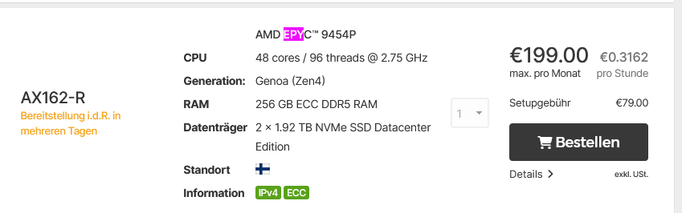
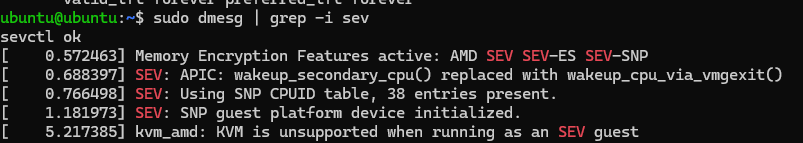

# Building a **6.16-rc5** Ubuntu-style kernel with **SEV-SNP host support**

_for AMD EPYC 9454 bare-metal servers_

---

## Introduction

This guide walks you through building a custom Ubuntu-compatible Linux kernel (version 6.16-rc5) with full SEV-SNP host support. SEV-SNP (Secure Encrypted Virtualization - Secure Nested Paging) significantly enhances VM isolation and security by encrypting VM memory, providing protection even from a compromised hypervisor. The resulting kernel and packages are easy to manage with standard Ubuntu tools.

Ideal for:

- Evaluating the security and performance impact of SEV-SNP.
- Running nested SEV-enabled virtual machines securely.
- Research, experimentation, or educational purposes involving advanced virtualization and security features.

  **Repository extras**

- The repo isn’t just a build script: it also hosts **forks** of every upstream project I rely on (kernel, QEMU, OVMF, SVSM) **plus pre-built packages/Kernel and ready-to-flash firmware images**.
- Some of these forks carry **small patches that fix/skip compiler hiccups or OS-specific quirks** (e.g. `-Werror` promotions, missing `AC_SUBST`, OpenSSL static-link issues).
- In short: cloning the repo is a one-stop solution—perfect for reproducible builds, CI pipelines, or when you just want to _use_ SEV-SNP without hour-long compiles.

## Hardware Used

This guide has been tested on the following bare-metal server from Hetzner:



- **Model**: AX162-R (AMD EPYC™ 9454P)
- **Cores**: 48 cores / 96 threads @ 2.75 GHz (Zen4)
- **RAM**: 256 GB ECC DDR5 RAM
- **Storage**: 2 × 1.92 TB NVMe SSD Datacenter Edition

The Hetzner support team is extremely helpful and responsive regarding BIOS updates and providing remote KVM consoles for BIOS configurations or troubleshooting boot and network issues.
(_Believe me, their remote console access saved my life several times—especially when builds were missing essential drivers like networking or RAID support._)

## 1 · What you get

- A bootable `6.16.0-061600rc5-generic` kernel **and** matching `linux-headers`
- SEV, SEV-ES **and** SEV-SNP **host** support compiled-in
- Clean `.deb` packages you can install / remove like any other Ubuntu kernel

---

## 2 · Hardware & firmware checklist

| BIOS page                          | Setting                                                  | Value                                                                             |
| ---------------------------------- | -------------------------------------------------------- | --------------------------------------------------------------------------------- |
| **CPU Common Options**             | ` SVM Mode``SEV Control``SEV-ES ASID Space Limit``SMEE ` | `**Enabled**`**Enabled**`512` (or `1007` if _all_ ASIDs for SEV/SNP)``**Enabled** |
| **CPU Common Options (continued)** | `SNP Memory Coverage`                                    | **Enabled**                                                                       |
| **NBIO Common Options**            | `SEV-SNP Support`                                        | **Enabled**                                                                       |
| **NBIO Common Options**            | `IOMMU`                                                  | **Enabled**                                                                       |
| **DDR Security**                   | ` TSME``SME-MK `                                         | `Enabled or Disabled (doesn’t affect SEV)`_Disabled_                              |
| (optional)                         | `PPIN Opt-in`                                            | **Auto** / Enabled                                                                |

**Important:**

- **Update your BIOS/EFI to the latest available version** from your vendor to ensure compatibility, security patches, and the availability of these options.
- The listed settings come from AMI Aptio 2.22.1285 firmware (common in Supermicro/HPE systems). Other vendors may organize these settings differently or use slightly different labels.
- Always verify your specific CPU’s ASID space limit, as recommended values (`512` or `1007`) depend on your specific usage scenario (number of concurrent SEV/SNP VMs).

---

## 3 · Ubuntu prerequisites

```bash
sudo apt update
sudo apt install build-essential flex bison libelf-dev \
                 dwarves bc kmod cpio unzip curl \
                 git fakeroot libncurses-dev
```

## 4 · Grab the 6.16-rc5

```bash
cd /usr/src
git clone --depth 1 --branch v6.16-rc5 https://git.kernel.org/pub/scm/linux/kernel/git/torvalds/linux.git
cd linux


```

### 5 · Start from your current config

```bash
cp /boot/config-$(uname -r) .config
yes "" | make olddefconfig              # accept new defaults
```

### 6 · Flip the SNP host switches

Either with menuconfig …

```bash
make menuconfig
#  → Processor type and features  → AMD Secure Encrypted Virtualization (SEV) support [*]
#      [*] AMD SEV-SNP guest support
#      [*] AMD SEV-SNP host support
#  → Processor type and features  → AMD Memory Encryption Support [*]
#  → Device Drivers → Misc devices → AMD PSP-based cryptographic coprocessor (CCP) [M]
#  → Cryptographic API → Support for AMD Secure Processor (SP) crypto offload [M]
# save & exit
```

…or scripted:

```bash
scripts/config \
        --enable CONFIG_KVM_AMD_SEV           \
        --enable CONFIG_KVM_AMD_SEV_SNP       \
        --enable CONFIG_KVM_AMD_SEV_SNP_HOST  \
        --enable CONFIG_AMD_MEM_ENCRYPT       \
        --module CONFIG_CRYPTO_DEV_SP_PSP     \
        --module CONFIG_CRYPTO_DEV_CCP
yes "" | make olddefconfig
```

### 7 · Build Ubuntu-flavoured .deb packages

Tip: append a local version suffix so ≠Ubuntu tools don’t overwrite distro kernels.

```bash
make -j$(nproc) bindeb-pkg LOCALVERSION=-snp
```

Four files land one directory above:

```bash
../linux-headers-6.16.0-rc5-snp_*.deb
../linux-image-6.16.0-rc5-snp_*.deb
../linux-image-6.16.0-rc5-snp-dbg_*.deb  (optional)
../linux-libc-dev_6.16.0-rc5-snp_*.deb   (userspace headers)
```

### 8 · Install & boot

```bash
cd ..
sudo dpkg -i linux-image-6.16.0-rc5-snp_*amd64.deb \
            linux-headers-6.16.0-rc5-snp_*amd64.deb \
            linux-libc-dev_6.16.0-rc5-snp_*amd64.deb
sudo update-grub
sudo reboot
```

### 9 · Verify

```bash
uname -r
# → 6.16.0-rc5-snp

dmesg | grep -i -e sev -e snp | head
# Should show:
#   AMD Memory Encryption Features active: SME SEV SEV-ES SEV-SNP
#   KVM: SEV enabled, SEV-ES supported by host, SEV-SNP supported by host
```

<br>
<br>

# Build additional packages

> Host → QEMU 9.1.0 (+KVM-SNP) → OVMF-SNP → SVSM (Coconut/Hecate) → L2 Ubuntu
> PSP/CCP device visible & `sevctl ok` passes (SME/SNP failures for some CPUs are fine).

### 1 Host Preparation

```bash
sudo apt install -y build-essential gcc g++ clang git ninja-build \
                    pkg-config libglib2.0-dev libpixman-1-dev \
                    libfdt-dev libslirp-dev libcap-ng-dev \
                    autoconf automake libtool libssl-dev \
                    python3-dev python3-pip cmake
pip install --user ninja meson
```

### 2 Build QEMU 9.1.0-git with SNP support

```bash
cd /opt
sudo git clone https://gitlab.com/qemu-project/qemu.git -b v9.1.0
cd qemu
sudo ./configure --prefix=/usr/local \
                 --enable-kvm \
                 --enable-slirp \
                 --target-list=x86_64-softmmu
sudo make -j$(nproc)
sudo make install
```

Fixes encountered

    - unknown option --enable-sev – not needed ≥ 6.2, SNP is auto-enabled when KVM+AMD.

    - Broken build after earlier attempts ⇒ git clean -xfd && git reset --hard HEAD.

### 3 Obtain OVMF-SNP firmware

```bash
cd ~
rm -rf edk2
git clone https://github.com/tianocore/edk2.git
cd edk2
git checkout edk2-stable202502
git submodule update --init
```

Edit the following file:

```bash
nano OvmfPkg/OvmfPkgX64.dsc
```

Add this line under the [Defines] section:

```ini
DEFINE SNP_ENABLE = TRUE
```

Rebuild the firmware

```bash
make -C BaseTools clean
make -C BaseTools
export EDK_TOOLS_PATH=$PWD/BaseTools
. edksetup.sh BaseTools
build -a X64 -t GCC5 -p OvmfPkg/OvmfPkgX64.dsc -D SNP_ENABLE=TRUE -b RELEASE
```

Verify and copy the built firmware files:

```bash
ls Build/OvmfX64/RELEASE_GCC5/FV/OVMF_CODE.fd
ls Build/OvmfX64/RELEASE_GCC5/FV/OVMF_VARS.fd

sudo mkdir -p /opt/ovmf-snp
sudo cp Build/OvmfX64/RELEASE_GCC5/FV/OVMF_CODE.fd /opt/ovmf-snp/
sudo cp Build/OvmfX64/RELEASE_GCC5/FV/OVMF_VARS.fd /opt/ovmf-snp/
```

| Error                                                | Fix                                                               |
| ---------------------------------------------------- | ----------------------------------------------------------------- |
| `ProcessLibraryConstructorList` implicit declaration | Update to GCC 12 +**or** add `-Wno-implicit-function-declaration` |
| `GenFfs` use-after-free / pointer after `fclose`     | Add `-Wno-error=use-after-free` to **BaseTools** CFLAGS           |
| Brotli / Vfr: warnings treated as errors (`-Werror`) | Append `-Wno-vla-parameter` to CFLAGS                             |

### 4 Build SVSM (Coconut / Hecate)

```bash
cd /opt
git clone https://github.com/coconut-svsm/svsm.git
cd svsm

# Need rust ≥ 1.86 and nightly
curl --proto '=https' --tlsv1.2 -sSf https://sh.rustup.rs | sh
source $HOME/.cargo/env
rustup toolchain install nightly
rustup override set nightly

# Build deps (openssl, libtcgtpm) – first run will autopull
make -j"$(nproc)"
```

libtcgtpm autoconf fix

```bash
sudo apt install autoconf automake libtool
cd libtcgtpm/deps/tpm-20-ref/TPMCmd
./bootstrap          # regenerates aclocal.m4 etc.
```

Common SVSM build pitfalls

| Symptom                         | Resolution                                     |
| ------------------------------- | ---------------------------------------------- |
| `package requires rustc 1.86.0` | `rustup update && rustup override set nightly` |
| `AC_SUBST / AS_IF` errors       | install autoconf; re-run `./bootstrap`         |
| OpenSSL static fails            | `sudo apt install libssl-dev`                  |

Resulting kernel blobs:

```bash
bin/stage1-trampoline.bin
bin/stage2.bin
bin/svsm-kernel.elf         # full ELF
bin/coconut-qemu.igvm       # image for QEMU
```

### 5 · Prepare the L2 Ubuntu Cloud-Image

```bash
# Workspace for guest disks / cloud-init
sudo mkdir -p /opt/vms && cd /opt/vms

# 1) Grab a current Ubuntu Cloud image (24.04 = noble)
wget https://cloud-images.ubuntu.com/noble/current/noble-server-cloudimg-amd64.img \
     -O ubuntu-cloud.img

# 2) Grow it from ~600 MiB to 20 GiB
qemu-img resize ubuntu-cloud.img +20G

# 3) Minimal cloud-init seed (login: ubuntu / password or your SSH key)
cat > user-data <<'EOF'
#cloud-config
hostname: snp-guest
password: ubuntu
chpasswd: { expire: False }
ssh_pwauth: true
ssh_authorized_keys:
  - ssh-ed25519 AAAA…YOUR_PUBLIC_KEY…
EOF

/opt/vms/ubuntu-cloud.img   # virtio disk (20 GiB)
/opt/vms/seed.iso           # cloud-init ISO
echo "instance-id: snp-test" > meta-data

# 4) Create ISO (cidata) that QEMU presents as CD-ROM
genisoimage -output seed.iso -volid cidata -joliet -rock user-data meta-data
```

Files now present

```bash
/opt/vms/ubuntu-cloud.img   # virtio disk (20 GiB)
/opt/vms/seed.iso           # cloud-init ISO
```

### 6 Launch chain (Host → SVSM → L2 Ubuntu)

```bash
/usr/local/bin/qemu-system-x86_64 \
  -enable-kvm \
  -machine q35,confidential-guest-support=sev0 \
  -object sev-snp-guest,id=sev0,cbitpos=51,reduced-phys-bits=1,policy=0x30000 \
  -cpu host \
  -smp 8 -m 8G \
  -bios /opt/ovmf-snp/OVMF_CODE.fd \
  -kernel /opt/svsm/bin/coconut-qemu.igvm \
  -append "svsm_params console=ttyS0" \
  -drive if=virtio,file=/opt/vms/ubuntu-cloud.img \
  -drive if=virtio,media=cdrom,format=raw,file=/opt/vms/seed.iso \
  -netdev user,id=net0,hostfwd=tcp::2222-:22 \
  -device virtio-net-pci,netdev=net0 \
  -nographic
```

### 7 · Log in & verify inside the guest

> The cloud-init seed above enables **SSH on port 2222** (_user_: `ubuntu`,
> either the password “ubuntu” or the public key you pasted).

```bash
ssh -i ~/.ssh/id_cloud -o StrictHostKeyChecking=no -o UserKnownHostsFile=/dev/null -p 2222 ubuntu@localhost

# (or ssh -i id_ed25519 -p 2222 ubuntu@localhost)

# ---------------------  Inside the VM (L2 Ubuntu)  ---------------------

# 1) Quick CPU-flag check
grep -i sev /proc/cpuinfo | head -1
# → flags: … sev sev_es sev_snp …

# 2) Kernel messages
dmesg | grep -i -e sev -e snp | head
# → “Memory Encryption Features active: SEV SEV-ES SEV-SNP”
# → “SEV-SNP guest platform device initialized”
```



# Congratulations — you now have a full SEV-SNP stack at your fingertips. Happy tinkering!
"# Nested_Confidential_Virtualization" 
